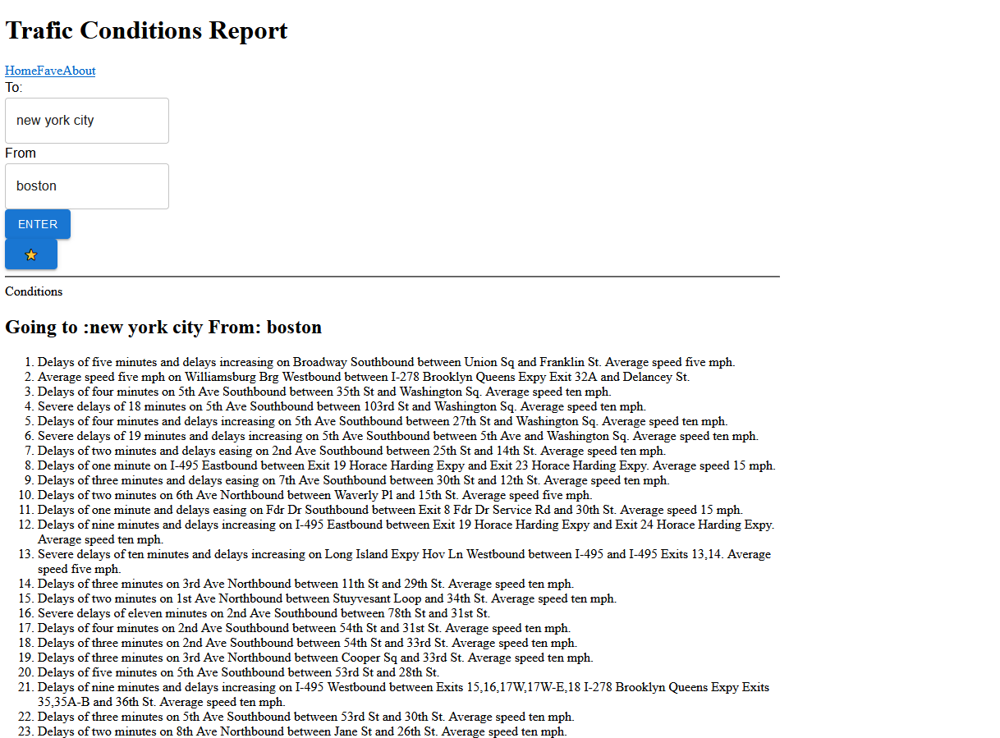
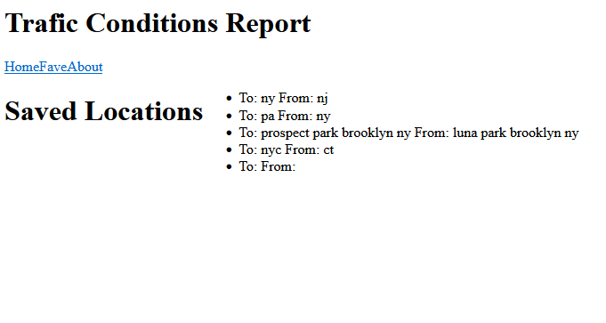

# project-2
# Trafic Conditions Report App
Input two locations and get a list of current incidents of trafic congestion along the route. 
Click the star to save an entered route.
 
This project uses the [Mapquest](https://developer.mapquest.com/) geocoding and trafic incidents api, [Material ui](https://mui.com/), and Create-React-App
## Examples

